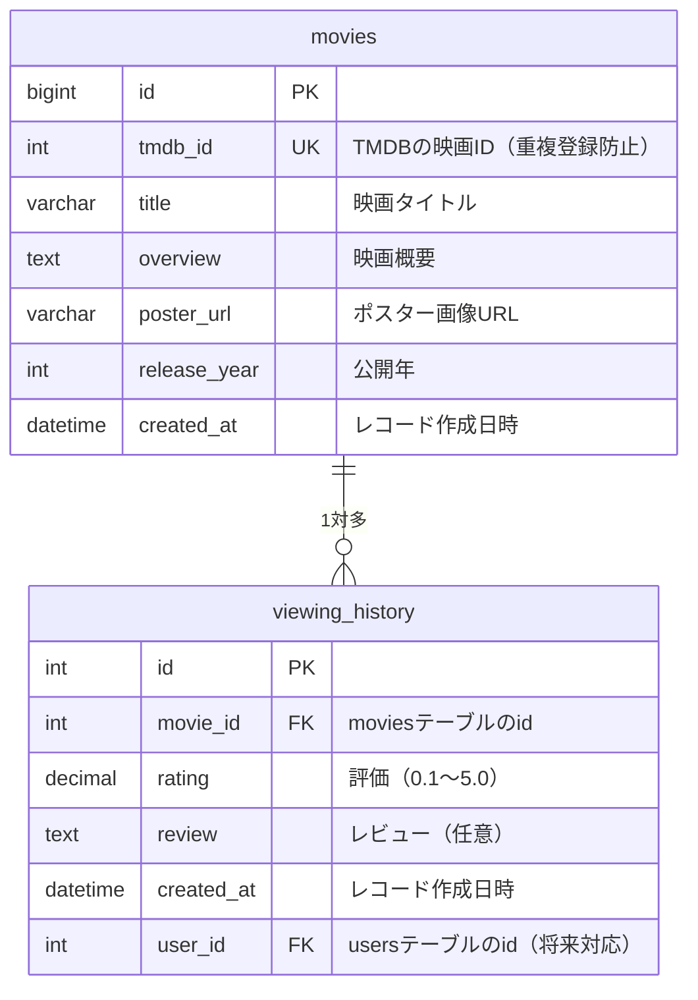

# DB詳細設計書

## 1. テーブル一覧

| テーブル名 | 説明 |
|-----------|------|
| movies | 映画カタログ（TMDBから取得した情報を保存） |
| viewing_history | 個人の視聴履歴（評価・レビューを含む） |

---

## 2. テーブル定義

### movies テーブル

| カラム名 | データ型 | NULL | デフォルト | 説明 |
|---------|---------|------|-----------|------|
| id | BIGINT | NOT NULL | AUTO_INCREMENT | 主キー |
| tmdb_id | INT | NOT NULL | - | TMDBの映画ID（重複登録防止） |
| title | VARCHAR(255) | NOT NULL | - | 映画タイトル |
| overview | TEXT | NULL | - | 映画概要 |
| poster_url | VARCHAR(512) | NULL | - | ポスター画像URL |
| release_year | INT | NULL | - | 公開年 |
| created_at | DATETIME | NOT NULL | CURRENT_TIMESTAMP | レコード作成日時 |

**制約・インデックス**
- PRIMARY KEY: `id`
- UNIQUE: `tmdb_id`（同じ映画の二重登録を防ぐ）

---

### viewing_history テーブル

| カラム名 | データ型 | NULL | デフォルト | 説明 |
|---------|---------|------|-----------|------|
| id | INT | NOT NULL |  AUTO_INCREMENT| 主キー|
| movie_id | INT | NOT NULL |  -| moviesテーブルのid（外部キー）|
| rating| DECIMAL(3,1) | NOT NULL | - | 評価 |
| review| TEXT  | NULL | - | レビュー |
| created_at | DATETIME | NOT NULL | CURRENT_TIMESTAMP | レコード作成日時 |
| user_id | INT | NULL | - | usersテーブルのid（外部キー）|

**制約・インデックス**
- PRIMARY KEY: `id`
- FOREIGN KEY: `movie_id` → `movies.id`
- FOREIGN KEY: `user_id` → `users.id`（将来）
- INDEX: `movie_id`（映画ごとの履歴を検索するため）

---

## 3. ER図

> - `||--o{` = 1つのmovieに対してviewing_historyは0件以上（多）
> - `user_id` は将来のユーザー認証追加時に参照先（users.id）が確定する
