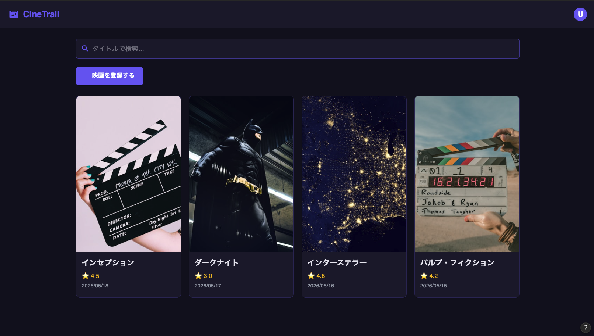
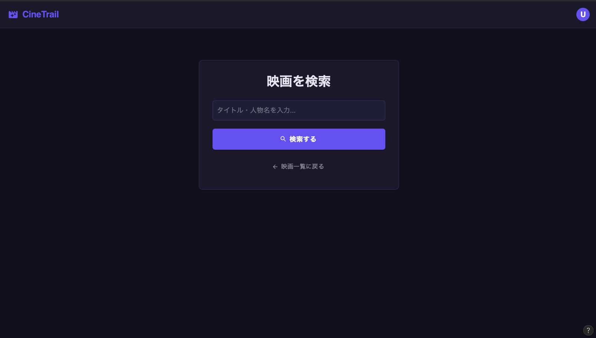
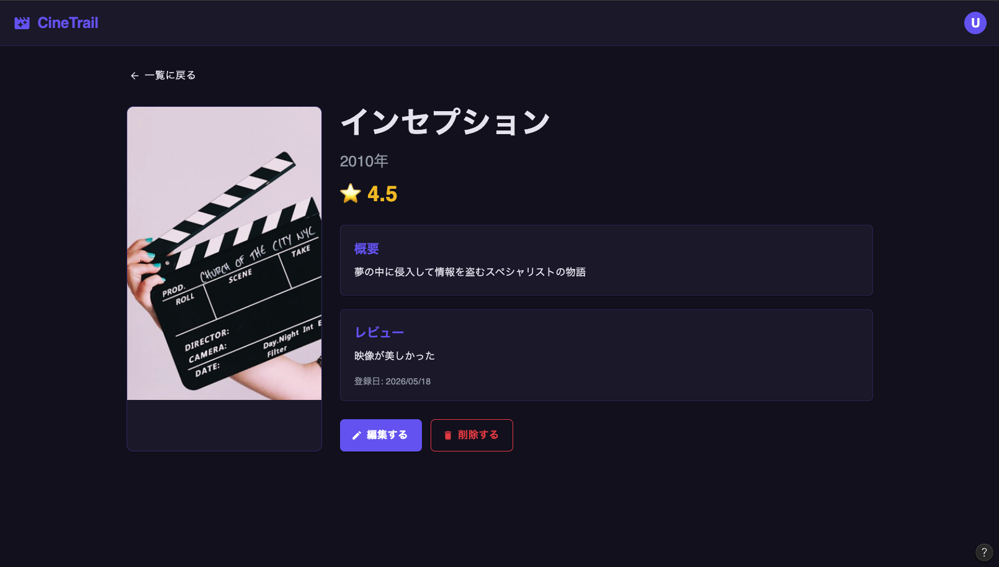
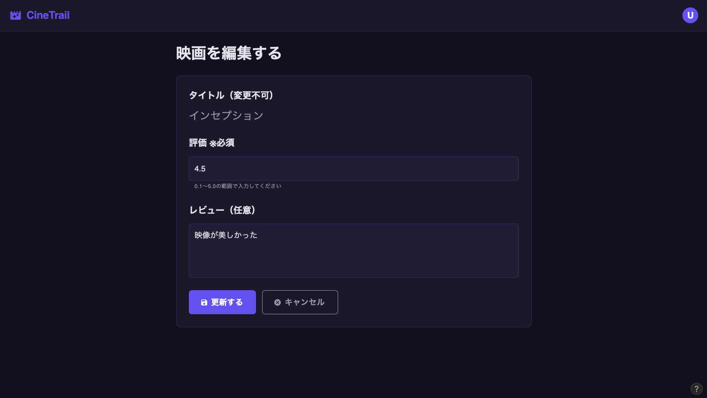
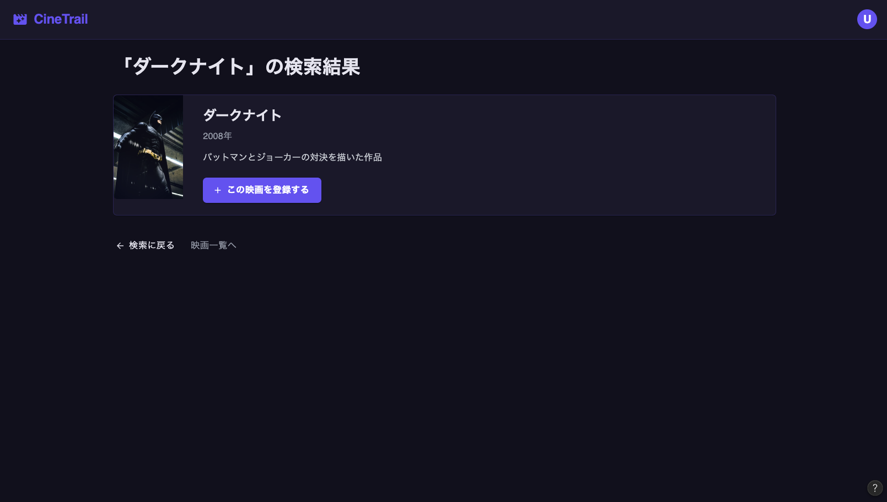
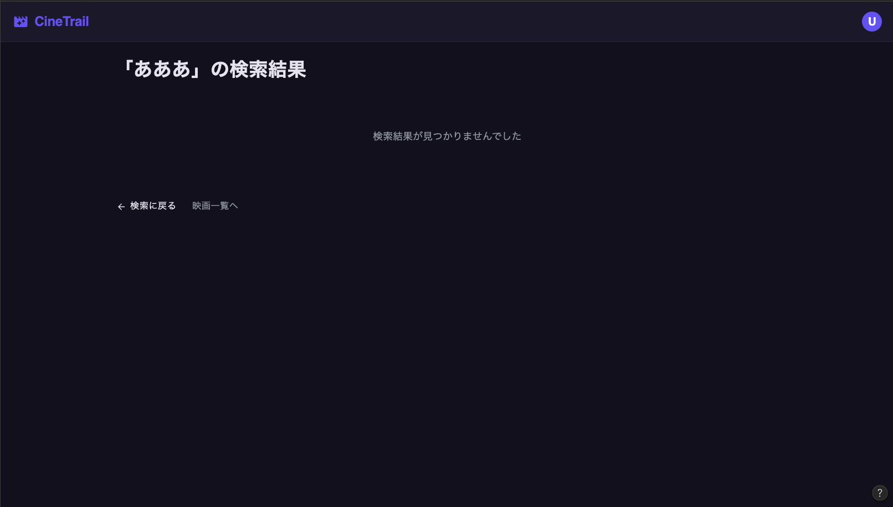
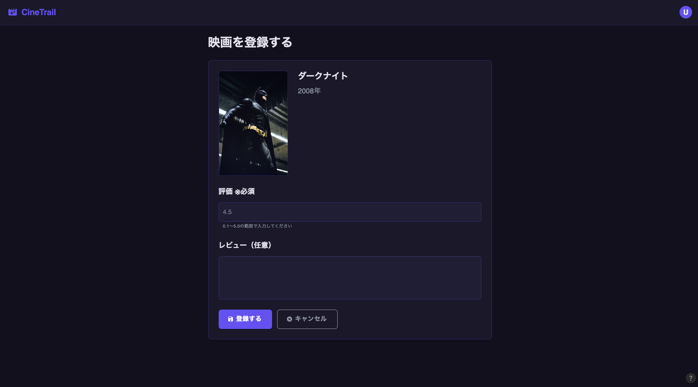
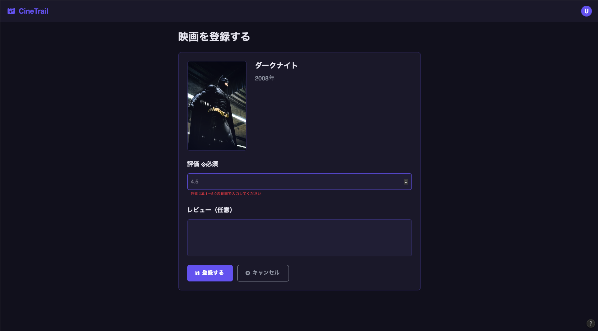

# モックアップ

> 各画面のデザインモックアップです。
> ツール：Figma Make
> 格納先：`docs/images/`

---

## 映画一覧画面　`/`

---

## TMDB検索画面　`/movies/search`

---

## 映画詳細画面　`/movies/:id`

---

## 映画編集画面　`/movies/:id/edit`

---

## TMDB検索結果画面　`/movies/search/results`

### 検索結果あり

### 検索結果なし（空状態）

---

## 映画登録画面　`/movies/new`

### 通常状態

### バリデーションエラー状態

